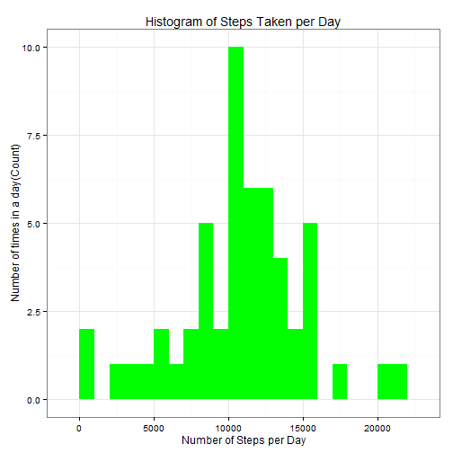
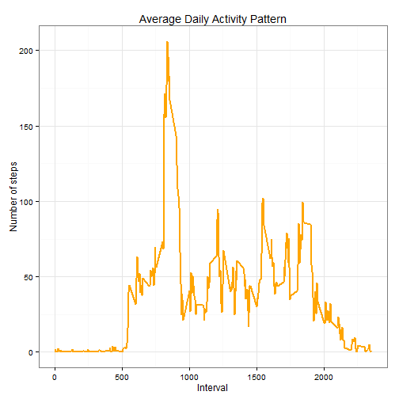
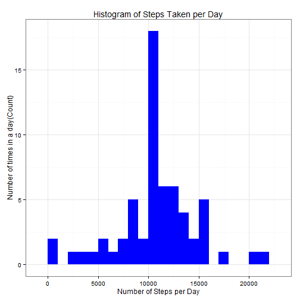

## Loading and preprocessing the data
Load required libraries

```r
library(knitr)
opts_chunk$set(echo = TRUE, results = 'hold')
```

```r
library(data.table)
library(ggplot2) 
```

Unzip then load data using  read.csv()

```r
unzip("activity.zip")
rdata <- read.csv('activity.csv', header = TRUE, sep = ",",colClasses=c("numeric", "character", "numeric"))
```

Process and format

```r
rdata$date <- as.Date(rdata$date, format = "%Y-%m-%d")
rdata$interval <- as.factor(rdata$interval)
```

## What is mean total number of steps taken per day?
calculate the total steps per day

```r
steps_per_day <- aggregate(steps ~ date, rdata, sum)
colnames(steps_per_day) <- c("date","steps")
```
histogram of the total number of steps taken per day

```r
ggplot(steps_per_day, aes(x = steps)) + 
       geom_histogram(fill = "green", binwidth = 1000) + 
        labs(title="Histogram of Steps Taken per Day", 
             x = "Number of Steps per Day", y = "Number of times in a day(Count)") + theme_bw() 
```

 

!(figure/Rplot1.png) 

calculate the mean and median of the number of steps taken per day

```r
steps_mean   <- mean(steps_per_day$steps, na.rm=TRUE)
steps_median <- median(steps_per_day$steps, na.rm=TRUE)
```


## What is the average daily activity pattern?
calculate the aggregation of steps by intervals of 5-minutes and convert the intervals as integers and save them in a data frame called steps_per_interval.

```r
steps_per_interval <- aggregate(rdata$steps, 
                                by = list(interval = rdata$interval),
                                FUN=mean, na.rm=TRUE)
#convert to integers
##this helps in plotting
steps_per_interval$interval <- 
        as.integer(levels(steps_per_interval$interval)[steps_per_interval$interval])
colnames(steps_per_interval) <- c("interval", "steps")								
```

make the plot with the time series of the average number of steps taken (averaged across all days) versus the 5-minute intervals:


```r
ggplot(steps_per_interval, aes(x=interval, y=steps)) +   
        geom_line(color="orange", size=1) +  
        labs(title="Average Daily Activity Pattern", x="Interval", y="Number of steps") +  
        theme_bw()
```

 
!(figure/Rplot2.png) 
we find the 5-minute interval with the containing the maximum number of steps:

```r
max_interval <- steps_per_interval[which.max(  
        steps_per_interval$steps),]
```

## Imputing missing values

1. Total number of missing values:

The total number of missing values in steps can be calculated using is.na() method to check whether the value is mising or not and then summing the logical vector.

```r
missing_vals <- sum(is.na(rdata$steps))
```
The total number of missing values are 2304.

2. filling in all of the missing values in the dataset

To populate missing values, we choose to replace them with the mean value at the same interval across days. In most of the cases the median is a better centrality measure than mean, but in our case the total median is not much far away from total mean, and probably we can make the mean and median meets.

We create a function na_fill(data, pervalue) which the data arguement is the rdata data frame and pervalue arguement is the steps_per_interval data frame.

```r
na_fill <- function(data, pervalue) {
        na_index <- which(is.na(data$steps))
        na_replace <- unlist(lapply(na_index, FUN=function(idx){
                interval = data[idx,]$interval
                pervalue[pervalue$interval == interval,]$steps
        }))
        fill_steps <- data$steps
        fill_steps[na_index] <- na_replace
        fill_steps
}

rdata_fill <- data.frame(  
        steps = na_fill(rdata, steps_per_interval),  
        date = rdata$date,  
        interval = rdata$interval)
```

3. A histogram of the total number of steps taken each day

Now let us plot a histogram of the daily total number of steps taken, plotted with a bin interval of 1000 steps, after filling missing values.

```r
fill_steps_per_day <- aggregate(steps ~ date, rdata_fill, sum)
colnames(fill_steps_per_day) <- c("date","steps")

##plotting the histogram
ggplot(fill_steps_per_day, aes(x = steps)) + 
       geom_histogram(fill = "blue", binwidth = 1000) + 
        labs(title="Histogram of Steps Taken per Day", 
             x = "Number of Steps per Day", y = "Number of times in a day(Count)") + theme_bw() 			 
```

 
!(figure/Rplot3.png) 

Calculate and report the mean and median total number of steps taken per day.

```r
steps_mean_fill   <- mean(fill_steps_per_day$steps, na.rm=TRUE)
steps_median_fill <- median(fill_steps_per_day$steps, na.rm=TRUE)
```

The mean is 10766.189 and median is 10766.189.
**Do these values differ from the estimates from the first part of the assignment?**

Yes, these values do differ slightly.

    Before filling the data
        **Mean** : 10766.189
        **Median**: 10765

    After filling the data
        **Mean** : 10766.189
        **Median**: 10766.189

We see that the values after filling the data mean and median are equal.
**What is the impact of imputing missing data on the estimates of the total daily number of steps?**

As you can see, comparing with the calculations done in the first section of this document, we observe that while the mean value remains unchanged, the median value has shifted and virtual matches to the mean.

Since our data has shown a t-student distribution (see both histograms), it seems that the impact of imputing missing values has increase our peak, but it's not affect negatively our predictions. 


## Are there differences in activity patterns between weekdays and weekends?

We do this comparison with the table with filled-in missing values.
1. Augment the table with a column that indicates the day of the week
2. Subset the table into two parts - weekends (Saturday and Sunday) and weekdays (Monday through Friday).
3. Tabulate the average steps per interval for each data set.
4. Plot the two data sets side by side for comparison.

```r
weekdays_steps <- function(data) {
    weekdays_steps <- aggregate(data$steps, by=list(interval = data$interval),
                          FUN=mean, na.rm=T)
    # convert to integers for plotting
    weekdays_steps$interval <- 
            as.integer(levels(weekdays_steps$interval)[weekdays_steps$interval])
    colnames(weekdays_steps) <- c("interval", "steps")
    weekdays_steps
}


data_by_weekdays <- function(data) {
    data$weekday <- 
            as.factor(weekdays(data$date)) # weekdays
    weekend_data <- subset(data, weekday %in% c("Saturday","Sunday"))
    weekday_data <- subset(data, !weekday %in% c("Saturday","Sunday"))

    weekend_steps <- weekdays_steps(weekend_data)
    weekday_steps <- weekdays_steps(weekday_data)

    weekend_steps$dayofweek <- rep("weekend", nrow(weekend_steps))
    weekday_steps$dayofweek <- rep("weekday", nrow(weekday_steps))

    data_by_weekdays <- rbind(weekend_steps, weekday_steps)
    data_by_weekdays$dayofweek <- as.factor(data_by_weekdays$dayofweek)
    data_by_weekdays
}

data_weekdays <- data_by_weekdays(rdata_fill)
```
Below you can see the panel plot comparing the average number of steps taken per 5-minute interval across weekdays and weekends:

```r
ggplot(data_weekdays, aes(x=interval, y=steps)) + 
        geom_line(color="violet") + 
        facet_wrap(~ dayofweek, nrow=2, ncol=1) +
        labs(x="Interval", y="Number of steps") +
        theme_bw()
```

 
!(figure/Rplot4.png) 

We can see at the graph above that activity on the weekday has the greatest peak from all steps intervals. But, we can see too that weekends activities has more peaks over a hundred than weekday. This could be due to the fact that activities on weekdays mostly follow a work related routine, where we find some more intensity activity in little a free time that the employ can made some sport. In the other hand, at weekend we can see better distribution of effort along the time.
